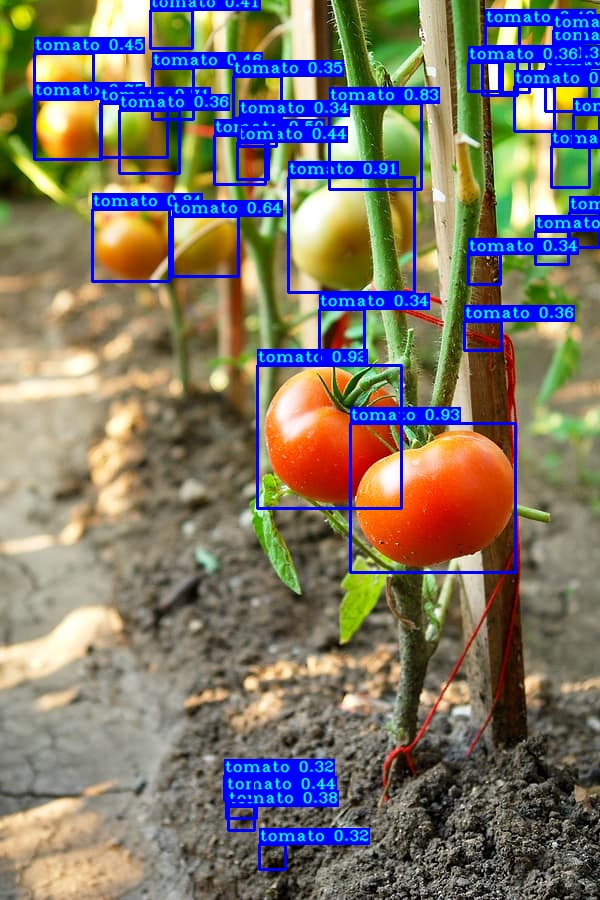

# TensorFlow-for-Social-Good
YOLOv3 implementation in TensorFlow 2.3.1 forked from pythonlessons. Original readme can be found in originalreadme.txt

# Overview
Some examples of tomato detection using the YOLO v4 model.
<p align="left">
    </a>
    </a>
</p>


# Install
To install simply clone the repository.
- Required depencencies can be installed through requirements.txt
```
pip install -r ./requirements.txt
```
- Pretrained weights and checkpoints are already included and installed from the original repository
- Checkpoints and weights can be found in my TSG Data repository
```
git clone https://github.com/lorestew/TSG-Data.git
```
-Place contents directly into the folder and replace existing folders

# Guide
detection_custom.py can be used to test the model on images of tomatoes/diseases. Test images have been provided inside of the IMAGES folder. Modify lines 19 and 23 to change the image.
```
detection_custom.py
```
To change any existing code, train, or change model refer to original repository.
